# VFIO Automation Framework Architecture

This document outlines the architecture for the Exliar VFIO Automation Framework, focusing on Stage 1 (Core Foundation) with an emphasis on GPU detection and compatibility across different vendors.

## Key Insights from vfio-auto Reference Code

The existing project demonstrates several important patterns for VFIO automation that we should consider:

1. **Distribution Agnostic Design**: The code intelligently detects system properties (boot loaders, init systems, initramfs systems) rather than hard-coding for specific distros.

2. **Multiple System Compatibility**: The framework supports various boot loaders (GRUB, systemd-boot), init systems, and handles differences between AMD and Intel systems.

3. **Modular Organization**: The project separates concerns (PCI device management, bootloader config, etc.) into distinct modules.

4. **Safety Measures**: The code creates backups before making system changes and provides cleanup options.

5. **Thorough Environment Checks**: Extensive validation of IOMMU groups, CPU virtualization, Secure Boot status, etc.

## Areas for Improvement

Based on the existing code, we can improve in these areas:

1. **Error Handling**: Replace Python error handling with Rust's more robust error system.

2. **Plugin Architecture**: Implement a true plugin system vs. the current modular design.

3. **State Management**: Create a more robust state tracking system for applied changes.

4. **Cross-Platform Testing**: Build CI/CD pipeline for testing across distributions.

5. **Terminal UI**: Implement the planned TUI for better user experience.

6. **Concurrency**: Leverage Rust's async capabilities for parallel operations.

## Enhanced GPU Detection and Compatibility

GPU passthrough requires special handling for different vendors:

### GPU Detection System

```rust
pub enum GpuVendor {
    AMD,
    NVIDIA,
    Intel,
    Other(String)
}

pub struct GpuDevice {
    pci_device: Box<dyn PciDevice>,
    vendor: GpuVendor,
    model_name: String,
    vram_size: Option<u64>,
    is_integrated: bool,
    architecture: String,      // e.g., "Ampere", "RDNA2", "Xe"
    driver_capabilities: GpuDriverCapabilities,
}

pub struct GpuDriverCapabilities {
    supports_reset: bool,      // Can GPU be reset without system reboot
    requires_acs_override: bool, // Needs ACS override patch for IOMMU separation
    supports_fbc: bool,        // Supports frame buffer compression
    supports_gvt: bool,        // Supports Intel GVT-g virtualization
    has_reset_bug: bool,       // Has the AMD reset bug
    needs_code_43_workaround: bool, // Needs NVIDIA Code 43 workaround
    supports_vbios_loading: bool, // Supports custom VBIOS loading
}
```

### Vendor-specific Detection and Handling

```rust
// Vendor-specific trait implementations
pub trait GpuVendorHandler {
    fn detect_gpus(&self) -> Result<Vec<GpuDevice>>;
    fn prepare_for_passthrough(&self, gpu: &GpuDevice) -> Result<()>;
    fn apply_quirks(&self, gpu: &GpuDevice, vm_config: &VmConfig) -> Result<()>;
    fn generate_xml_snippets(&self, gpu: &GpuDevice) -> Result<String>;
    fn post_passthrough_checks(&self, gpu: &GpuDevice) -> Result<()>;
}

// Vendor implementations
pub struct AmdGpuHandler {}
pub struct NvidiaGpuHandler {}
pub struct IntelGpuHandler {}
```

### Vendor-Specific Passthrough Considerations

#### AMD GPU Handling

```rust
impl GpuVendorHandler for AmdGpuHandler {
    // Detect AMD GPUs and their capabilities
    fn detect_gpus(&self) -> Result<Vec<GpuDevice>> {
        // Implementation to detect AMD GPUs
        // Parse /sys/class/drm/card*/device/vendor, device
        // Check for reset bug vulnerability based on architecture
    }

    fn prepare_for_passthrough(&self, gpu: &GpuDevice) -> Result<()> {
        // AMD-specific preparation
        // 1. Check for reset bug vulnerability (common in older cards)
        // 2. Check if amdgpu or radeon driver is used
        // 3. Configure AMD-specific kernel parameters
        // 4. If GCN architecture, add specific handling
        // 5. For RDNA cards, handle different requirements
    }

    fn apply_quirks(&self, gpu: &GpuDevice, vm_config: &VmConfig) -> Result<()> {
        // AMD-specific VM configuration quirks
        // 1. Apply reset_bug workaround options if needed 
        // 2. Add vendor_id hiding if needed
        // 3. Configure appropriate ROM loading parameters
        // 4. Handle audio function passthrough properly
    }
}
```

#### NVIDIA GPU Handling

```rust
impl GpuVendorHandler for NvidiaGpuHandler {
    fn detect_gpus(&self) -> Result<Vec<GpuDevice>> {
        // Implementation to detect NVIDIA GPUs
        // Check for various models & architectures
        // Detect driver version to determine compatibility
    }

    fn prepare_for_passthrough(&self, gpu: &GpuDevice) -> Result<()> {
        // NVIDIA-specific preparation
        // 1. Check for Code 43 vulnerability based on driver version
        // 2. Check for NVIDIA driver binding and prepare unbinding
        // 3. Handle Optimus/Prime configurations
        // 4. Prepare for specific driver blocking needs
    }

    fn apply_quirks(&self, gpu: &GpuDevice, vm_config: &VmConfig) -> Result<()> {
        // NVIDIA-specific VM configuration quirks
        // 1. Apply "kvm=off" for Code 43 prevention
        // 2. Add <hidden state='on'/> to mask hypervisor
        // 3. Configure vendor_id hiding
        // 4. Add ROM loading with specific settings
        // 5. Add hookscripts for primary/secondary GPU mode
    }
}
```

#### Intel GPU Handling

```rust
impl GpuVendorHandler for IntelGpuHandler {
    fn detect_gpus(&self) -> Result<Vec<GpuDevice>> {
        // Implementation to detect Intel GPUs
        // Check for integrated vs. discrete (new Arc GPUs)
        // Identify GVT-g capabilities
    }

    fn prepare_for_passthrough(&self, gpu: &GpuDevice) -> Result<()> {
        // Intel-specific preparation
        // 1. For integrated: check if GVT-g is available & preferred
        // 2. For Arc discrete: special new handling
        // 3. Configure intel_iommu settings
    }

    fn apply_quirks(&self, gpu: &GpuDevice, vm_config: &VmConfig) -> Result<()> {
        // Intel-specific VM configuration quirks
        // 1. For integrated GPUs: configure GVT-g if available
        // 2. For Arc GPUs: similar to AMD discrete handling
        // 3. Handle special requirements for newer generations
    }
}
```

### GPU Detection and Database System

```rust
pub struct GpuDatabase {
    // Known GPU models and their quirks
    known_models: HashMap<String, GpuQuirks>,
    
    // Detection results cache
    detection_cache: Option<Vec<GpuDevice>>,
}

impl GpuDatabase {
    // Load GPU database from embedded JSON or fetch online updates
    fn load() -> Result<Self> {}
    
    // Check if a GPU has known issues
    fn check_compatibility(&self, gpu: &GpuDevice) -> GpuCompatibility {}
    
    // Get specific passthrough recommendations for a GPU model
    fn get_passthrough_recommendations(&self, gpu: &GpuDevice) -> Vec<String> {}
    
    // Get known workarounds for specific issues
    fn get_known_workarounds(&self, gpu: &GpuDevice, issue: GpuIssueType) -> Option<Vec<Workaround>> {}
}
```

### VBIOS Handling

```rust
pub struct VbiosManager {
    gpu_devices: Vec<GpuDevice>,
    vbios_storage: Path,
}

impl VbiosManager {
    // Dump VBIOS from a GPU when possible
    fn dump_vbios(&self, gpu: &GpuDevice) -> Result<PathBuf> {}
    
    // Patch VBIOS if needed (e.g., for NVIDIA)
    fn patch_vbios(&self, vbios_path: &Path, gpu: &GpuDevice) -> Result<PathBuf> {}
    
    // Configure VM to properly load VBIOS
    fn configure_vbios_loading(&self, vm_config: &mut VmConfig, gpu: &GpuDevice, vbios_path: &Path) -> Result<()> {}
}
```

## Stage 1 Core Foundation Plan

```mermaid
graph TD
    A[Core Foundation] --> B[System Detection Module]
    A --> C[PCI Management Module]
    A --> D[Boot Configuration Module]
    A --> E[VFIO Module Manager]
    A --> F[State Tracking System]
    A --> G[Plugin System]
    A --> H[GPU Compatibility Module]
    
    B --> B1[Bootloader Detection]
    B --> B2[Init System Detection]
    B --> B3[Kernel Version Detection]
    
    C --> C1[Device Enumeration]
    C --> C2[IOMMU Group Validation]
    
    D --> D1[GRUB Configuration]
    D --> D2[systemd-boot Configuration]
    D --> D3[Kernel Parameter Management]
    
    E --> E1[Module Configuration]
    E --> E2[Initramfs Integration]
    E --> E3[Driver Binding/Unbinding]
    
    F --> F1[Change Tracking]
    F --> F2[Rollback Support]
    F --> F3[State Serialization]
    
    G --> G1[Plugin Interface]
    G --> G2[Plugin Loading]
    G --> G3[Hook System]
    
    H --> H1[Vendor Detection]
    H --> H2[GPU Quirks Database]
    H --> H3[VBIOS Management]
    H --> H4[Driver Compatibility]
    H --> H5[Reset Bug Detection]
    H --> H6[VM Config Generation]
```



## Implementation Strategy

### 1. System Detection Module

First, we'll create a system detection layer that identifies:

```rust
pub struct SystemInfo {
    // Bootloader information
    bootloader_type: BootloaderType,  // enum: Grub, SystemdBoot, PopOsKernelstub, etc.
    kernel_version: KernelVersion,     // struct with major, minor, patch
    
    // CPU information
    cpu_vendor: CpuVendor,            // enum: AMD, Intel, Other
    virtualization_enabled: bool,
    
    // Init system
    init_system: InitSystem,          // enum: Systemd, OpenRC, etc.
    
    // Initramfs system
    initramfs_system: InitramfsSystem, // enum: Mkinitcpio, Dracut, Debian, etc.
    
    // Security information
    secure_boot_enabled: Option<bool>, // None if can't be determined
    
    // Distribution information
    distribution: Distribution,       // struct with name, version, etc.
}
```

### 2. PCI Management Module

This module will handle PCI device detection, IOMMU group analysis, and GPU identification:

```rust
pub trait PciDevice {
    fn bdf(&self) -> &str;
    fn vendor_id(&self) -> &str;
    fn device_id(&self) -> &str;
    fn class(&self) -> &str;
    fn driver(&self) -> &str;
    // Additional device properties
}

pub struct GpuDevice {
    pci_device: Box<dyn PciDevice>,
    vendor: GpuVendor,  // enum: AMD, NVIDIA, Intel
    model_name: String,
    vram_size: Option<u64>,
}

pub struct IommuGroup {
    id: u32,
    devices: Vec<Box<dyn PciDevice>>,
}
```

### 3. Boot Configuration Module

For safely managing kernel parameters:

```rust
pub trait BootConfigManager {
    fn detect_parameters(&self) -> Result<Vec<String>>;
    fn add_parameters(&self, params: &[&str]) -> Result<()>;
    fn remove_parameters(&self, params: &[&str]) -> Result<()>;
    fn create_backup(&self) -> Result<PathBuf>;
    fn restore_backup(&self, backup_path: &Path) -> Result<()>;
}

// Implementations for each bootloader type
pub struct GrubConfig { /* ... */ }
pub struct SystemdBootConfig { /* ... */ }
pub struct KernelstubConfig { /* ... */ }
```

### 4. VFIO Module Manager

For handling VFIO module configuration and loading:

```rust
pub struct VfioManager {
    modules: Vec<String>,
    system_info: SystemInfo,
}

impl VfioManager {
    fn configure_modprobe(&self, device_ids: &[&str]) -> Result<()>;
    fn configure_modules_load(&self) -> Result<()>;
    fn update_initramfs(&self) -> Result<()>;
    fn bind_device_to_vfio(&self, device: &dyn PciDevice) -> Result<()>;
    fn unbind_device(&self, device: &dyn PciDevice) -> Result<()>;
}
```

### 5. State Tracking System

For tracking changes and enabling rollbacks:

```rust
pub struct ChangeTracker {
    changes: Vec<Change>,
    backup_paths: HashMap<String, PathBuf>,
}

pub enum Change {
    FileModified { path: PathBuf, backup: PathBuf },
    KernelParamAdded { param: String },
    ModuleLoaded { name: String },
    DriverBound { device_bdf: String, driver: String },
    // Other change types
}

impl ChangeTracker {
    fn record_change(&mut self, change: Change) -> Result<()>;
    fn generate_cleanup_script(&self) -> Result<String>;
    fn rollback_all(&self) -> Result<()>;
    fn save_state(&self, path: &Path) -> Result<()>;
    fn load_state(path: &Path) -> Result<Self>;
}
```

### 6. Plugin System

A flexible plugin architecture for extensions:

```rust
pub trait VfioPlugin {
    fn name(&self) -> &str;
    fn version(&self) -> &str;
    fn description(&self) -> &str;
    
    fn on_init(&self, context: &PluginContext) -> Result<()>;
    fn on_device_detect(&self, device: &dyn PciDevice, context: &PluginContext) -> Result<()>;
    fn on_pre_vfio_bind(&self, device: &dyn PciDevice, context: &PluginContext) -> Result<()>;
    fn on_post_vfio_bind(&self, device: &dyn PciDevice, context: &PluginContext) -> Result<()>;
    fn on_cleanup(&self, context: &PluginContext) -> Result<()>;
    // Other lifecycle hooks
}

pub struct PluginManager {
    plugins: Vec<Box<dyn VfioPlugin>>,
}

impl PluginManager {
    fn load_plugin(&mut self, path: &Path) -> Result<()>;
    fn unload_plugin(&mut self, name: &str) -> Result<()>;
    fn call_hook(&self, hook_name: &str, context: &PluginContext) -> Result<()>;
}
```

## GPU Passthrough Compatibility Strategy

We'll implement a comprehensive approach to GPU passthrough compatibility:

### 1. GPU Database & Knowledge Base

We'll build a database of known GPU models with:
- Common passthrough issues
- Required quirks for each model
- Driver compatibility information
- Reset bug status
- VBIOS handling requirements

This database will be updateable and community-sourced, with a baseline embedded in the application.

### 2. GPU Detection Workflow

1. Detect all GPUs in the system
2. Identify primary and secondary GPUs
3. Check for vendor-specific requirements
4. Validate IOMMU grouping for each GPU
5. Assess driver compatibility and reset capability
6. Generate vendor-specific recommendations

### 3. Vendor-Specific Passthrough Logic

We'll implement specialized handlers for:

**NVIDIA GPUs:**
- Code 43 detection and prevention
- Optimal Hypervisor hiding techniques
- Driver version compatibility checking
- Optimus/Prime handling in laptops
- VBIOS extraction and patching if needed

**AMD GPUs:**
- Reset bug detection and workarounds
- Different handling for GCN vs. RDNA architectures
- Driver compatibility assessment
- Special handling for APUs vs. discrete GPUs

**Intel GPUs:**
- GVT-g virtualization for integrated GPUs
- Special handling for new Arc discrete GPUs
- Shared vs. dedicated mode configuration

### 4. GPU Monitoring & Testing

After configuration, we'll implement:
- Reset capability testing
- Performance baseline measurement
- Driver compatibility verification
- VBIOS loading validation
- ROM bar size configuration

## Directory Structure

```
docs/
  ├── vfio-auto/  (reference project)
  └── exliar-vfio/
      ├── design/
      │   ├── architecture.md
      │   ├── plugin-system.md
      │   ├── detection-system.md
      │   └── gpu-compatibility.md
      ├── gpu-database/
      │   ├── amd-gpus.json
      │   ├── nvidia-gpus.json
      │   └── intel-gpus.json
      ├── distribution-compatibility.md
      ├── gpu-compatibility.md
      └── development-guide.md

src/
  ├── main.rs
  ├── cli.rs
  ├── core/
  │   ├── mod.rs
  │   ├── system.rs       (System detection)
  │   ├── pci.rs          (PCI management)
  │   ├── bootloader.rs   (Boot configuration)
  │   ├── vfio.rs         (VFIO module management)
  │   └── state.rs        (State tracking)
  ├── gpu/
  │   ├── mod.rs
  │   ├── detection.rs    (GPU detection)
  │   ├── vendor/         (Vendor-specific modules)
  │   │   ├── amd.rs
  │   │   ├── nvidia.rs
  │   │   └── intel.rs
  │   ├── quirks.rs      (GPU quirks database)
  │   ├── vbios.rs       (VBIOS management)
  │   └── reset.rs       (GPU reset handling)
  ├── plugin/
  │   ├── mod.rs
  │   ├── api.rs          (Plugin API)
  │   └── manager.rs      (Plugin manager)
  ├── ui/
  │   ├── mod.rs
  │   └── tui.rs          (Terminal UI)
  └── utils/
      ├── mod.rs
      └── logging.rs      (Logging utilities)
```

## Initial Development Steps

1. **System Detection Module**: Implement system detection functionality.

2. **GPU Detection Module**: Now prioritized - implement robust GPU detection with vendor-specific handling.

3. **PCI Management Module**: Develop PCI device enumeration and IOMMU group analysis.

4. **GPU Quirks Database**: Create the initial database of known GPU compatibility issues.

5. **Boot Configuration Module**: Implement bootloader detection and configuration.

6. **VFIO Module Manager**: Implement VFIO module configuration based on detected system.

7. **State Tracking**: Develop the change tracking system with rollback capabilities.

8. **Plugin System**: Define the plugin API and basic manager functionality.

9. **Terminal UI**: Implement a basic TUI for interacting with the system.