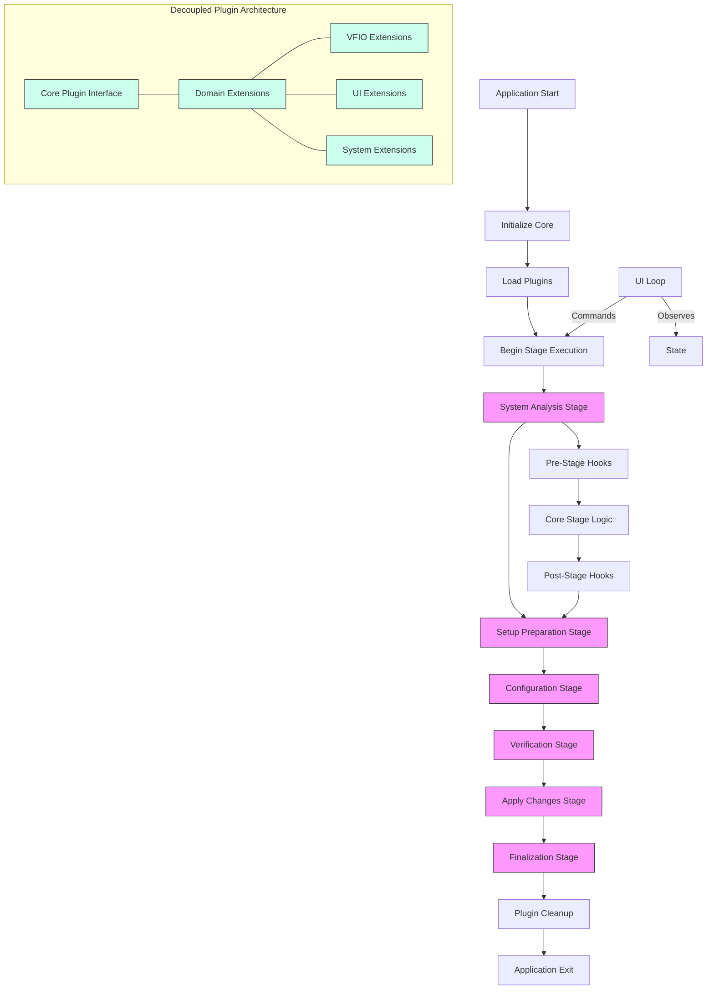

# Exliar VFIO: Project Structure and Contribution Guide

This document provides a comprehensive guide to the Exliar VFIO Automation Framework architecture, development workflow, and contribution guidelines. It's designed to help both new and experienced contributors understand the project's structure and how to effectively contribute.

## Table of Contents

1. [Core Architecture Principles](#core-architecture-principles)
2. [Project Structure Overview](#project-structure-overview)
3. [Plugins System Explained](#plugins-system-explained)
4. [Execution Stages and Flow](#execution-stages-and-flow)
5. [Contribution Workflow](#contribution-workflow)
6. [Development Guidelines](#development-guidelines)
7. [Testing and Quality Assurance](#testing-and-quality-assurance)

## Core Architecture Principles

Exliar VFIO is built on four foundational principles that guide its architecture and development:

### 1. Plugin-First Architecture

All core functionalities are implemented as plugins that can be extended or replaced. This gives the project maximum flexibility while keeping a clean core system.

- **What This Means:** Each feature like GPU detection, bootloader management, or VFIO configuration exists as a standalone plugin.
- **Why It Matters:** You can replace, enhance, or disable any functionality without changing the core system.

### 2. Stage-Based Execution Flow

The application operates through clearly defined stages with predictable ordering and extension points.

- **What This Means:** Plugin code executes within specific stage hooks (like "system detection" or "configuration").
- **Why It Matters:** You always know when your code will run relative to other components.

### 3. Clear Separation of Concerns

The system strictly separates orchestration logic, plugin implementations, state management, and user interface.

- **What This Means:** Each component has one job and clear boundaries.
- **Why It Matters:** You can modify one area without unexpected impacts on others.

### 4. Well-Defined APIs and Interfaces

All communication between components happens through explicitly defined APIs.

- **What This Means:** Components interact only through formal interfaces, not implementation details.
- **Why It Matters:** This creates stability and allows components to evolve independently.

## Project Structure Overview

The project follows a logical organization that reflects its plugin-centric architecture:

```
src/
├── main.rs                # Entry point: Initializes core systems
├── error.rs               # Centralized error definitions
│
├── core/                  # Core orchestration system
│   ├── mod.rs             # Exports core components
│   └── orchestrator.rs    # Stage management and plugin lifecycles
│
├── plugin_api/            # Plugin interface definitions
│   ├── mod.rs             # Core Plugin trait, PluginContext, hooks
│   ├── error.rs           # Plugin error types
│   ├── types.rs           # Shared data structures and traits
│   └── extensions/        # Domain-specific plugin extensions
│       ├── vfio.rs        # VFIO-specific plugin extensions
│       ├── ui.rs          # UI-specific plugin extensions
│       └── system.rs      # System-specific plugin extensions
│
├── plugin_manager/        # Plugin discovery and loading
│   ├── mod.rs             # Plugin registration and management
│   └── discovery.rs       # Plugin discovery logic
│
├── plugins/               # All core features as plugins
│   ├── mod.rs             # Plugin registration
│   │
│   ├── system_detect/     # System detection plugin
│   │   └── mod.rs         # Implements VfioPlugin trait
│   │
│   ├── gpu_detect/        # GPU detection plugin
│   │   └── mod.rs         # Implements VfioPlugin trait
│   │
│   ├── bootloader/        # Bootloader management plugin
│   │   ├── mod.rs         # Main bootloader plugin logic
│   │   ├── grub.rs        # GRUB-specific implementation
│   │   └── systemd_boot.rs # systemd-boot implementation
│   │
│   └── ...                # Other functionality plugins
│
├── state/                 # Application state management
│   ├── mod.rs             # Central state structure definition
│   └── events.rs          # State change event definitions
│
├── ui/                    # User interface layer
│   ├── mod.rs             # UI entry points
│   ├── tui/               # Terminal UI implementation
│   │   ├── mod.rs         # TUI module exports
│   │   ├── app.rs         # TUI application runner
│   │   └── render.rs      # TUI rendering logic
│   └── command.rs         # UI-to-Core commands
│
└── utils/                 # Centralized utilities - CRITICAL COMPONENT
    ├── mod.rs             # Utility exports
    ├── logging.rs         # Logging system
    ├── file.rs            # File operations utilities
    ├── system.rs          # System interaction utilities
    └── ...                # Other utility modules
```

### Key Structural Elements

- **Core (core/)**: The orchestrator that manages stages and plugin lifecycles
- **Plugin API (plugin_api/)**: Defines the contract plugins must implement
- **Plugins (plugins/)**: All actual functionality implemented as plugins
- **State (state/)**: Centralized application state
- **UI (ui/)**: User interface that observes state and issues commands
- **Utils (utils/)**: Centralized repository for all shared functionality - any operation used more than once MUST be placed here

## Plugins System Explained

The plugin system is the heart of Exliar VFIO's architecture. Plugins can be categorized into two main types:

1. **Stage-specific plugins**: Execute during specific stages of the application lifecycle
2. **Service plugins**: Run continuously throughout the application's lifetime

Both are implemented using the same core plugin interface but differ in how they integrate with the application.

### Plugin Interface - Proper Decoupling

The plugin system is completely decoupled from specific functionality domains (like VFIO). This starts with a generic `Plugin` trait as the foundation:

```rust
// The core Plugin trait - domain-agnostic
pub trait Plugin: Send + Sync {
    // Identity
    fn name(&self) -> &str;
    fn version(&self) -> &str;
    fn description(&self) -> &str;
    fn author(&self) -> &str;
    
    // Lifecycle
    fn on_load(&self, context: &mut PluginContext) -> Result<(), PluginError>;
    fn on_unload(&self, context: &mut PluginContext) -> Result<(), PluginError>;
    
    // Generic hook system
    fn on_hook(&self, hook_name: &str, context: &mut PluginContext) -> Result<(), PluginError> {
        // Default implementation ignores unknown hooks
        Ok(())
    }
}
```

Domain-specific plugin extensions are then built on top of this generic interface:

```rust
// VFIO-specific plugin extension
pub trait VfioPlugin: Plugin {
    fn hook_system_detect(&self, context: &mut PluginContext) -> Result<(), PluginError>;
    fn hook_post_system_detect(&self, context: &mut PluginContext) -> Result<(), PluginError>;
    fn hook_pre_vfio_bind(&self, context: &mut PluginContext) -> Result<(), PluginError>;
    // Other VFIO-specific hooks...
}

// UI-specific plugin extension
pub trait UiPlugin: Plugin {
    fn register_ui_components(&self, registry: &mut UiRegistry) -> Result<(), PluginError>;
    fn on_ui_event(&self, event: &UiEvent, context: &mut PluginContext) -> Result<(), PluginError>;
    // UI-specific hooks...
}

// Base implementation that routes generic hooks to specific ones
impl<T: VfioPlugin> Plugin for T {
    // Base Plugin methods are implemented...
    
    fn on_hook(&self, hook_name: &str, context: &mut PluginContext) -> Result<(), PluginError> {
        match hook_name {
            "system_detect" => self.hook_system_detect(context),
            "post_system_detect" => self.hook_post_system_detect(context),
            "pre_vfio_bind" => self.hook_pre_vfio_bind(context),
            // Map other hooks...
            _ => Ok(()) // Unknown hooks are ignored
        }
    }
}
```

### Plugin Context

Plugins receive a `PluginContext` that provides:

- **Access to core services**: Loggers, configuration, etc.
- **Storage for plugin state**: Save and retrieve plugin-specific data
- **Communication channels**: Events for inter-plugin communication

```rust
// Example plugin using the decoupled architecture
impl Plugin for MyPlugin {
    fn on_load(&self, context: &mut PluginContext) -> Result<(), PluginError> {
        // Store plugin configuration
        let config = MyPluginConfig::from_global_config(context.config());
        context.set("my_plugin_config", config);
        Ok(())
    }
    
    fn on_hook(&self, hook_name: &str, context: &mut PluginContext) -> Result<(), PluginError> {
        // Access stored configuration
        let config = context.get::<MyPluginConfig>("my_plugin_config")
            .ok_or_else(|| PluginError::new("Config not found"))?;
            
        // Use configuration and update state
        // ...
        
        Ok(())
    }
}
```

### Creating a Plugin

To create a new plugin:

1. Create a new directory in `src/plugins/` (e.g., `src/plugins/my_feature/`)
2. Create a `mod.rs` file that implements `Plugin` and any needed extension traits
3. Register your plugin in `src/plugins/mod.rs`

Example of a minimal plugin with the decoupled architecture:

```rust
use crate::plugin_api::{Plugin, PluginContext, PluginError};
use crate::plugin_api::extensions::vfio::VfioPlugin;

pub struct MyFeaturePlugin;

// First implement the core Plugin trait
impl Plugin for MyFeaturePlugin {
    fn name(&self) -> &str {
        "my-feature"
    }
    
    fn version(&self) -> &str {
        "0.1.0"
    }
    
    fn description(&self) -> &str {
        "Adds my awesome feature to Exliar VFIO"
    }
    
    fn on_load(&self, context: &mut PluginContext) -> Result<(), PluginError> {
        context.logger().info("My feature plugin loaded!");
        Ok(())
    }
    
    fn on_unload(&self, context: &mut PluginContext) -> Result<(), PluginError> {
        context.logger().info("My feature plugin unloaded!");
        Ok(())
    }
    
    fn author(&self) -> &str {
        "Plugin Author"
    }
}

// Then implement the domain-specific extension trait if needed
impl VfioPlugin for MyFeaturePlugin {
    fn hook_post_system_detect(&self, context: &mut PluginContext) -> Result<(), PluginError> {
        // Your plugin logic here
        context.logger().info("Doing work after system detection");
        Ok(())
    }
    
    // Implement other required VFIO plugin hooks...
    fn hook_system_detect(&self, context: &mut PluginContext) -> Result<(), PluginError> {
        Ok(()) // Default implementation
    }
    
    fn hook_pre_vfio_bind(&self, context: &mut PluginContext) -> Result<(), PluginError> {
        Ok(()) // Default implementation
    }
}
```

The plugin manager only needs to know about the base `Plugin` trait:

```rust
pub struct PluginManager {
    plugins: Vec<Box<dyn Plugin>>,
    contexts: HashMap<String, PluginContext>,
}

impl PluginManager {
    // Register any plugin that implements the Plugin trait
    pub fn register_plugin(&mut self, plugin: Box<dyn Plugin>) -> Result<(), PluginError> {
        // Create context for this plugin
        let mut context = PluginContext::new();
        
        // Call plugin's on_load hook
        plugin.on_load(&mut context)?;
        
        // Store plugin and its context
        let name = plugin.name().to_string();
        self.plugins.push(plugin);
        self.contexts.insert(name, context);
        
        Ok(())
    }
    
    // Invoke hooks by name (decoupled from specific domains)
    pub fn invoke_hook(&mut self, hook_name: &str) -> Result<(), PluginError> {
        for plugin in &self.plugins {
            plugin.on_hook(hook_name, &mut self.contexts[plugin.name()])?;
        }
        Ok(())
    }
}
```

### Service Plugins

Service plugins provide continuous functionality throughout the application's lifetime:

1. **Initialization**: Set up during the application startup via `on_load`
2. **Background Operation**: Run continuously, often in separate threads
3. **State Observation**: React to state changes via event subscriptions
4. **Cleanup**: Properly shut down when the application exits via `on_unload`

Example of a service plugin (Discord RPC):

```rust
pub struct DiscordRpcPlugin {
    shutdown_signal: Arc<AtomicBool>,
    worker_thread: Option<JoinHandle<()>>,
}

impl DiscordRpcPlugin {
    pub fn new() -> Self {
        Self {
            shutdown_signal: Arc::new(AtomicBool::new(false)),
            worker_thread: None,
        }
    }
    
    fn start_rpc_service(&mut self, initial_state: AppState) -> Result<(), PluginError> {
        let shutdown = self.shutdown_signal.clone();
        let state_subscriber = initial_state.create_subscriber();
        
        // Start a background thread for Discord RPC
        self.worker_thread = Some(std::thread::spawn(move || {
            let mut discord = DiscordRpcClient::new("CLIENT_ID");
            discord.start();
            
            while !shutdown.load(Ordering::SeqCst) {
                if let Some(update) = state_subscriber.try_recv() {
                    // Update Discord status based on app state changes
                    // ...
                    discord.update_status(&update);
                }
                
                // Sleep to avoid high CPU usage
                std::thread::sleep(Duration::from_millis(100));
            }
            
            // Proper cleanup
            discord.close();
        }));
        
        Ok(())
    }
}

impl Plugin for DiscordRpcPlugin {
    // Standard plugin methods
    fn name(&self) -> &str { "discord-rpc" }
    fn version(&self) -> &str { "0.1.0" }
    fn description(&self) -> &str { "Discord Rich Presence integration" }
    fn author(&self) -> &str { "Exliar VFIO Team" }
    
    fn on_load(&self, context: &mut PluginContext) -> Result<(), PluginError> {
        // Initialize the plugin
        let mut plugin_instance = self.clone();
        
        // Get the initial app state
        let app_state = context.get::<AppState>("app_state")
            .ok_or_else(|| PluginError::new("App state not available"))?;
        
        // Start the background service
        plugin_instance.start_rpc_service(app_state.clone())?;
        
        // Store the instance with the running thread
        context.set("discord_rpc_instance", plugin_instance);
        
        Ok(())
    }
    
    fn on_unload(&self, context: &mut PluginContext) -> Result<(), PluginError> {
        // Signal the background thread to shut down
        if let Some(instance) = context.get::<DiscordRpcPlugin>("discord_rpc_instance") {
            instance.shutdown_signal.store(true, Ordering::SeqCst);
            
            // Wait for the thread to finish (with timeout)
            if let Some(thread) = &instance.worker_thread {
                if let Err(e) = thread.join() {
                    context.logger().warn(&format!("Error joining Discord RPC thread: {:?}", e));
                }
            }
        }
        
        Ok(())
    }
    
    // Hook into stage transitions to update Discord status
    fn hook_post_system_detect(&self, context: &mut PluginContext) -> Result<(), PluginError> {
        if let Some(system_info) = context.get::<SystemInfo>("system_info") {
            // Update RPC to show detected system
            // ...
        }
        Ok(())
    }
    
    // Other hook implementations as needed
}
```

## Execution Stages and Flow

The application follows a clear, stage-based execution flow:



### Stage Breakdown

1. **System Analysis Stage**
   - System information detection
   - Hardware identification
   - Driver and compatibility checks
   
2. **Setup Preparation Stage**
   - Resource preparation
   - Prerequisite validation
   
3. **Configuration Stage**
   - Bootloader configuration
   - Module configuration
   - VFIO setup preparation
   
4. **Verification Stage**
   - Configuration validation
   - Pre-apply checks
   
5. **Apply Changes Stage**
   - Apply configurations to system
   - Track applied changes
   
6. **Finalization Stage**
   - Final state recording
   - User notification

### How Plugins Interact with Stages

Plugins register hooks for specific stages they want to participate in:

1. **Pre-stage hooks**: Run before the main stage logic
2. **Main stage actions**: Core functionality within a stage
3. **Post-stage hooks**: Run after the main stage logic

Example flow:

```
Orchestrator: "Begin System Analysis Stage"
├── Call all plugins' pre_system_analysis hooks
├── Execute core system detection logic
├── Call all plugins' post_system_analysis hooks
Orchestrator: "System Analysis Complete"
```

This predictable execution order allows plugins to:
- Prepare resources before a stage begins
- Inspect or modify results after a stage completes
- Coordinate with other plugins through well-defined sequence points

### How Service Plugins Integrate with Stages

Service plugins that run continuously still integrate with the stage system:

1. **Initialization during early stages**:
   - Service plugins are loaded and initialized during application startup
   - Long-running operations start in separate threads

2. **Stage transition notifications**:
   - Service plugins can hook into stage transitions to update their state or behavior
   - For example, a Discord RPC plugin would update displayed information as the application moves through stages

3. **Event-based communication**:
   - Service plugins typically subscribe to state change events
   - They react to these events rather than waiting for specific stage hooks

4. **Cleanup during application shutdown**:
   - The `on_unload` hook ensures proper resource cleanup
   - Background threads are signaled to terminate and joined

## Contribution Workflow

Contributing to Exliar VFIO follows a straightforward process:

### 1. Choose a Contribution Type

- **New Plugin**: Add entirely new functionality
- **Plugin Enhancement**: Improve existing plugins
- **Core Improvements**: Enhance the orchestration system
- **UI Enhancements**: Improve user interaction
- **Documentation**: Clarify usage or development processes

### 2. Development Process

1. **Fork and Clone**: Start with your own fork of the repository
2. **Branch**: Create a feature branch for your work
3. **Develop**: Write your code following the architecture principles
4. **Test**: Ensure your changes work and don't break existing functionality
5. **Document**: Add or update documentation as needed
6. **Submit**: Create a pull request with a clear description

### 3. Plugin Development Example

Here's a step-by-step example of adding a new plugin:

1. **Create the plugin structure**:
   ```
   src/plugins/my_plugin/
   ├── mod.rs      # Main plugin implementation
   └── utils.rs    # Helper functions
   ```

2. **Implement the Plugin trait and any extensions** in `mod.rs`:
   ```rust
   use crate::plugin_api::{Plugin, PluginContext, PluginError};
   use crate::plugin_api::extensions::vfio::VfioPlugin;
   
   pub struct MyPlugin;
   
   // First implement the core Plugin trait
   impl Plugin for MyPlugin {
       fn name(&self) -> &str {
           "my-plugin"
       }
       
       fn version(&self) -> &str {
           "0.1.0"
       }
       
       fn description(&self) -> &str {
           "My plugin description"
       }
       
       fn author(&self) -> &str {
           "Plugin Author"
       }
       
       fn on_load(&self, context: &mut PluginContext) -> Result<(), PluginError> {
           Ok(())
       }
       
       fn on_unload(&self, context: &mut PluginContext) -> Result<(), PluginError> {
           Ok(())
       }
   }
   
   // Then implement any domain-specific extensions needed
   impl VfioPlugin for MyPlugin {
       fn hook_system_detect(&self, context: &mut PluginContext) -> Result<(), PluginError> {
           // Your plugin logic here
           Ok(())
       }
       
       // Other required VFIO hooks...
   }
   ```

3. **Register your plugin** in `src/plugins/mod.rs`:
   ```rust
   mod my_plugin;
   
   pub fn register_plugins(manager: &mut PluginManager) -> Result<(), PluginError> {
       // Register existing plugins
       manager.register_plugin(Box::new(system_detect::SystemDetectPlugin::new()))?;
       // Register your new plugin - note we only need to know it implements the Plugin trait
       manager.register_plugin(Box::new(my_plugin::MyPlugin))?;
       Ok(())
   }
   ```

## Development Guidelines

To ensure code quality and consistency, follow these practices:

### Plugin Best Practices

1. **Keep plugins focused**: Each plugin should have a single responsibility
2. **Use PluginContext for state**: Don't use global variables
3. **Handle errors gracefully**: Provide clear error messages
4. **Document your plugin**: Explain what it does and how to use it
5. **Respect stage boundaries**: Only perform actions in appropriate hooks
6. **Resource management**: For service plugins, ensure proper thread management and cleanup

#### Additional Guidelines for Service Plugins

1. **Proper thread management**:
   - Use atomic flags for shutdown signaling
   - Implement timeouts for thread joining
   - Handle thread panics gracefully

2. **State observation efficiency**:
   - Use non-blocking channels or observers
   - Implement throttling to avoid excessive updates
   - Consider using a change detection mechanism

3. **Error resilience**:
   - Recover gracefully from service interruptions
   - Log errors but avoid crashing the application
   - Implement reconnection strategies where appropriate

### Centralized Utilities and Code Reuse

The `utils/` directory is a **critical component** of our architecture that ensures consistent implementation and prevents code duplication:

1. **Zero Duplication Policy**: Any functionality needed in more than one place MUST be placed in the `utils/` directory - this is non-negotiable
2. **Common Operations**: File operations, system commands, text processing, and other reusable functions belong in `utils/`
3. **Utility Design**: Utils should be small, focused functions with clear purposes and good documentation
4. **Organization**: Utilities should be grouped by domain in separate files (e.g., `file.rs`, `system.rs`, `network.rs`)

Example of proper utility usage:

```rust
// BAD: Duplicated file reading logic in a plugin
fn my_plugin_function() -> Result<(), PluginError> {
    // Don't do this! This file reading logic might be needed elsewhere
    let content = std::fs::read_to_string("/etc/some/file")?;
    // ...process content...
}

// GOOD: Using centralized utility
fn my_plugin_function() -> Result<(), PluginError> {
    // Use the centralized utility instead
    let content = utils::file::read_system_file("/etc/some/file")?;
    // ...process content...
}
```

### Creating New Extension Traits

To extend the plugin system for new domains without modifying core code:

1. **Define the extension trait**:
   ```rust
   // In plugin_api/extensions/my_domain.rs
   pub trait MyDomainPlugin: Plugin {
       // Domain-specific hooks
       fn hook_domain_specific_action(&self, context: &mut PluginContext) -> Result<(), PluginError>;
       // Default implementations where appropriate
       fn hook_optional_action(&self, context: &mut PluginContext) -> Result<(), PluginError> {
           Ok(()) // Default empty implementation
       }
   }
   ```

2. **Update core hook routing**:
   ```rust
   // In plugin_api/extensions/my_domain.rs
   impl<T: MyDomainPlugin> Plugin for T {
       // Base methods implementation...
       
       fn on_hook(&self, hook_name: &str, context: &mut PluginContext) -> Result<(), PluginError> {
           match hook_name {
               "domain_specific_action" => self.hook_domain_specific_action(context),
               "optional_action" => self.hook_optional_action(context),
               _ => Ok(()) // Pass to parent implementation if needed
           }
       }
   }
   ```

3. **Register the extension with the orchestrator**:
   ```rust
   // In your domain-specific module initialization
   orchestrator.register_hook("domain_specific_action", Stage::MyDomainStage, HookTiming::Pre);
   ```

### Error Handling Best Practices

When implementing plugins, follow these error handling patterns:

1. **Use specific error types**:
   ```rust
   // In your plugin
   fn hook_system_detect(&self, context: &mut PluginContext) -> Result<(), PluginError> {
       // Don't do this:
       // let file = std::fs::File::open("/some/path").unwrap();
       
       // Do this instead:
       let file = std::fs::File::open("/some/path")
           .map_err(|e| PluginError::new(&format!("Failed to open config: {}", e)))?;
       
       // Process file...
       Ok(())
   }
   ```

2. **Log before returning errors**:
   ```rust
   fn some_action(&self, context: &mut PluginContext) -> Result<(), PluginError> {
       match some_operation() {
           Ok(value) => {
               // Process value...
               Ok(())
           }
           Err(e) => {
               context.logger().error(&format!("Operation failed: {}", e));
               Err(PluginError::new("Failed to complete operation"))
           }
       }
   }
   ```

### Code Style and Organization

1. **Modular code**: Break complex logic into smaller functions
2. **Clear naming**: Use descriptive names for functions and variables
3. **Documentation**: Add comments for complex logic and public APIs
4. **Error handling**: Use the Result type with proper error propagation
5. **Testing**: Write unit tests for your functionality

### UI Interaction Guidelines

The UI should:
1. **Only observe state**: No direct plugin manipulation
2. **Send commands to core**: All actions go through the orchestrator
3. **Be responsive**: Handle state updates gracefully
4. **Provide feedback**: Show operation status clearly

## Testing and Quality Assurance

Ensuring your contributions work correctly:

### Testing Approach

1. **Unit tests**: Test individual components in isolation
2. **Integration tests**: Verify plugins work with the orchestrator
3. **System tests**: Test the entire application on different configurations

### Example Test for a Plugin

```rust
#[cfg(test)]
mod tests {
    use super::*;
    
    #[test]
    fn test_my_plugin_system_detect_hook() {
        // Setup
        let plugin = MyPlugin;
        let mut context = create_test_context();
        
        // Execute
        let result = plugin.on_hook("system_detect", &mut context);
        
        // Verify
        assert!(result.is_ok());
        assert!(context.get::<bool>("feature_detected").unwrap());
    }
}
```

### Automated Checks

All contributions should pass:
1. **Cargo build**: Code compiles without errors and warnings
2. **Cargo test**: All tests pass
3. **Cargo clippy**: No linting warnings
4. **Cargo fmt**: Proper code formatting
5. **Code Duplication Check**: Verify no duplicated functionality exists that should be in utils

---

### Working with Plugin State Across Sessions

For plugins that need to persist state between application runs:

```rust
// In your plugin's implementation
fn on_load(&self, context: &mut PluginContext) -> Result<(), PluginError> {
    // Use the utils directory's filesystem utilities for this
    let state_path = utils::paths::get_plugin_state_path(self.name())?;
    
    // Load existing state if available
    if std::path::Path::new(&state_path).exists() {
        let state_data = utils::file::read_file(&state_path)?;
        let state: MyPluginState = utils::serialization::deserialize(&state_data)?;
        context.set("my_plugin_state", state);
    } else {
        // Initialize with default state
        context.set("my_plugin_state", MyPluginState::default());
    }
    
    Ok(())
}

fn on_unload(&self, context: &mut PluginContext) -> Result<(), PluginError> {
    // Save state for next session
    if let Some(state) = context.get::<MyPluginState>("my_plugin_state") {
        let state_path = utils::paths::get_plugin_state_path(self.name())?;
        let serialized = utils::serialization::serialize(state)?;
        utils::file::write_file(&state_path, &serialized)?;
    }
    
    Ok(())
}
```

By following these guidelines, you'll be able to effectively contribute to the Exliar VFIO project while maintaining its architecture and code quality standards. Whether you're adding new features, fixing bugs, or improving documentation, this guide provides the foundation you need to get started.